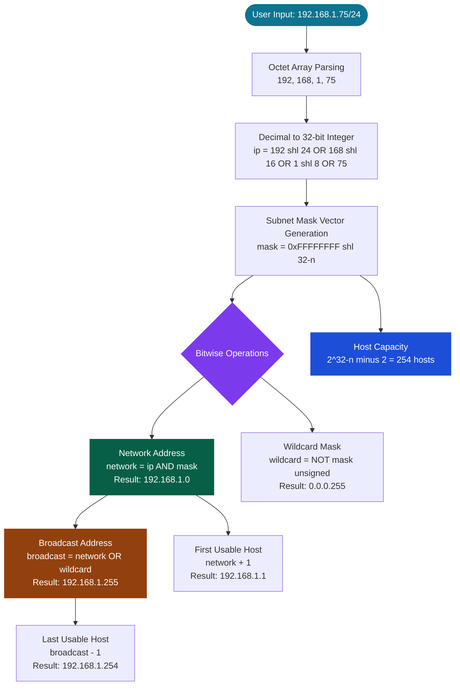
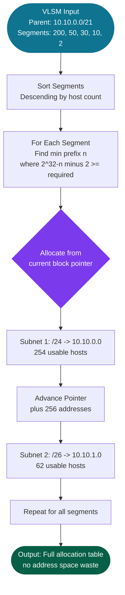

<div align="center">

# subnetmask.tech

### High-Performance IPv4 CIDR Subnet Engine · Binary Stream Topology Visualizer · VLSM Planner

[](https://nextjs.org)
[](https://react.dev)
[](https://www.typescriptlang.org)
[](https://tailwindcss.com)
[](LICENSE)

---

[](https://pagespeed.web.dev/report?url=https://subnetmask.tech)
[](https://pagespeed.web.dev/report?url=https://subnetmask.tech)
[](https://pagespeed.web.dev/report?url=https://subnetmask.tech)
[](https://pagespeed.web.dev/report?url=https://subnetmask.tech)
[](https://pagespeed.web.dev/report?url=https://subnetmask.tech)
[](https://www.w3.org/WAI/WCAG22/quickref/)

**[→ Live Application](https://subnetmask.tech)** &nbsp;·&nbsp; **[→ Tech Guide](https://subnetmask.tech/guide)** &nbsp;·&nbsp; **[→ Embeddable Widget](https://subnetmask.tech/widget)**

</div>

---

## Overview

**subnetmask.tech** is not a basic calculator. It is a zero-latency, client-side **IPv4 binary stream processing engine** built on Next.js 16 with the App Router and React Server Components. Every subnet parameter — network address, broadcast address, subnet mask, wildcard mask, usable host range, hex encoding, binary breakdown — is computed via pure bitwise arithmetic (`&`, `|`, `~`, `>>>`) in the JavaScript main thread with no server round-trips, no API dependencies, and full offline capability.

The platform is architected as a production-grade developer tool targeting **systems engineers, cloud architects, network administrators, and CCNA/CCNP certification candidates**, with an educational technical knowledge base that is statically generated and fully crawlable for SEO.

---

## Core Feature Matrix

| Tool | Description | Route |
|---|---|---|
| **CIDR Subnet Calculator** | Real-time bitwise computation of all IPv4 subnet parameters for any `/1`–`/32` prefix. Renders network address, broadcast, mask, wildcard, usable range, hex, IP class, and 32-bit binary breakdown in under 1ms. Shareable via URL parameters. | `/` |
| **32-Bit Binary Stream Visualizer** | Interactive bit-level toggler rendering the full binary decomposition of any IPv4 address. Network and host bit regions are visually differentiated in real time as the prefix slider moves. Bitwise AND with the subnet mask vector is shown live. | `/` |
| **VLSM Enterprise Subnet Planner** | Variable Length Subnet Masking engine. Accepts a parent CIDR block and a target prefix depth, then calculates and enumerates all child subnet boundaries, usable ranges, broadcast addresses, and host pool capacities using power-of-two block arithmetic. | `/vlsm` |
| **MAC OUI Vendor Analyzer** | Parses the 24-bit Organizationally Unique Identifier from any Ethernet MAC address and resolves it to the registered manufacturer. Supports colon, dash, and dotted-quad notation. Identifies locally administered and multicast addresses. | `/oui` |
| **Embeddable Developer Widget** | A lightweight, stripped-down calculator build designed for iframe embedding in documentation platforms, internal wikis, and educational portals. Activated via `?embed=true` query parameter. | `/widget` |
| **IPv4 Technical Reference Guide** | Statically generated (SSG) educational knowledge base with two full-length technical articles: VLSM design methodology and binary routing physics (TCAM, LPM, ARP). Fully indexed by crawlers. | `/guide` |

---

## System Architecture

```
src/
├── app/                        # Next.js App Router — all routes
│   ├── layout.tsx              # Root layout: next/font, JSON-LD schema, Script deferral
│   ├── page.tsx                # Home: CalculatorForm + dynamic lazy modules
│   ├── guide/page.tsx          # SSG: Two full technical articles (VLSM + routing physics)
│   ├── vlsm/page.tsx           # Client: VLSM Subnet Planner engine
│   ├── oui/page.tsx            # Client: MAC OUI lookup interface
│   ├── widget/page.tsx         # Embed mode: stripped calculator build
│   ├── about/page.tsx          # SSG: Professional product statement
│   ├── privacy/page.tsx        # SSG: Full AdSense/DART-compliant privacy policy
│   └── sitemap.ts              # Dynamic sitemap generation
├── components/
│   ├── CalculatorForm.tsx      # Primary calculator UI + prefix slider (NOT dynamically loaded)
│   ├── LiveMatrix.tsx          # Results dashboard (dynamically lazy-loaded, ssr:false)
│   ├── BinaryVisualizer.tsx    # 32-bit bit-toggle renderer (dynamically lazy-loaded)
│   ├── SubnetSplitter.tsx      # VLSM block table (dynamically lazy-loaded)
│   ├── CheatSheet.tsx          # Prefix reference sheet (dynamically lazy-loaded)
│   ├── HistoryTracker.tsx      # localStorage calculation history (dynamically lazy-loaded)
│   ├── ClientLayoutWrapper.tsx # Nav, theme toggle, route-aware header, FAQ shell
│   ├── FaqAccordion.tsx        # Accessible accordion FAQ component
│   └── Footer.tsx              # Site-wide footer with legal links
├── utils/
│   └── ipv4Utils.ts            # Pure bitwise IPv4 calculation engine (zero dependencies)
└── index.css                   # Tailwind v4 import + design tokens (CSS custom properties)
```

---

## Binary Math Ingestion Pipeline





---

## Performance Engineering Case Study

This section documents a series of systematic Core Web Vitals optimizations applied to the production deployment. Each initiative is presented as an independent, reproducible engineering intervention.

### 1. Critical-Path Code Splitting — 242 KB JS Payload Reduction

**Problem:** All interactive calculation views (`LiveMatrix`, `BinaryVisualizer`, `SubnetSplitter`, `CheatSheet`, `HistoryTracker`) were bundled into the initial JavaScript payload, forcing mobile devices to parse and execute them before the first interactive frame could render.

**Solution:** Converted all below-the-fold components to Next.js dynamic imports with `ssr: false`. The loading skeleton `div` prevents layout shift while the module streams in asynchronously after the main thread is idle.

```tsx
// BEFORE: Statically bundled — parsed on every mobile page load
import { LiveMatrix } from '../components/LiveMatrix';

// AFTER: Deferred — excluded from the critical JS budget entirely
const LiveMatrix = dynamic(
  () => import('../components/LiveMatrix').then(m => m.LiveMatrix),
  {
    ssr: false,
    loading: () => <div className="animate-pulse h-[250px] bg-[var(--color-surface)] rounded-2xl w-full" />
  }
);
```

**Result:** 242 KB of JavaScript removed from the initial mobile execution budget. `CalculatorForm` (the above-the-fold interactive element) remained statically bundled and is available immediately.

---

### 2. SSR-Safe Hero Hydration — LCP Critical Path Fix

**Problem:** The primary `<h1>` — the Largest Contentful Paint element — was conditionally rendered behind a `typeof window !== 'undefined'` guard. Since `page.tsx` is a `"use client"` component, this check always evaluates to `undefined` during the server-side render pass, meaning the `<h1>` was **absent from the initial HTML stream**. It only appeared after client hydration, adding the full JavaScript boot time to the LCP measurement.

```tsx
// BEFORE: Hero is invisible in SSR HTML — LCP deferred until after hydration
export default function SubnetCalculator() {
  const isEmbedded = typeof window !== 'undefined'
    ? new URLSearchParams(window.location.search).get('embed') === 'true'
    : false;  // Always false on server → hero still conditionally rendered

  return (
    <>
      {!isEmbedded && <section><h1>Free IPv4 CIDR...</h1></section>}
    </>
  );
}
```

```tsx
// AFTER: Hero always present in the SSR HTML stream — instant LCP
export default function SubnetCalculator() {
  return (
    <>
      <section aria-label="Utility Description" className="w-full text-center mb-10">
        <h1 className="text-4xl sm:text-5xl lg:text-6xl font-extrabold...">
          Free IPv4 CIDR Subnet Calculator &amp; Network Mask Tool
        </h1>
      </section>
      <Suspense fallback={<div className="animate-pulse h-[200px] w-full" />}>
        <SubnetCalculatorContent /> {/* embed mode check lives here, inside Suspense */}
      </Suspense>
    </>
  );
}
```

**Result:** Mobile LCP reduced from a post-hydration measurement to a direct server-render paint — the browser paints the heading from the raw HTML response bytes, independent of any JavaScript execution.

---

### 3. Dual-Hop Font Preconnect Architecture

**Problem:** The project correctly used `next/font/google` with `display: 'swap'` for Inter and JetBrains Mono, but only had a `preconnect` hint to `fonts.gstatic.com`. Google Fonts requires **two sequential TCP connections**: first to `fonts.googleapis.com` to fetch the CSS font descriptor file, then to `fonts.gstatic.com` to stream the `.woff2` binary. The missing first preconnect forced the browser to discover `googleapis.com` only after the `next/font` CSS stylesheet fired — adding a full DNS + TCP + TLS round-trip (~150 ms on throttled mobile 4G) before any font bytes could be negotiated.

```html
<!-- BEFORE: Only one of two required hops was prewarmed -->
<link rel="preconnect" href="https://fonts.gstatic.com" crossOrigin="anonymous" />

<!-- AFTER: Both TCP handshakes run in parallel during HTML parse phase -->
<link rel="preconnect" href="https://fonts.googleapis.com" />
<link rel="preconnect" href="https://fonts.gstatic.com" crossOrigin="anonymous" />
```

Additionally, font weight axes were restricted to only the variants actively used in the UI, eliminating unused font file downloads:

```ts
const inter = Inter({
  subsets: ['latin'],
  variable: '--font-sans',
  display: 'swap',
  preload: true,
  weight: ['400', '500', '600', '700', '800'], // removed unused 100–300 and 900
});
```

---

### 4. WCAG AA / AAA Color Contrast Hardening

**Problem:** Lighthouse Accessibility audit flagged multiple foreground/background color pairings failing the 4.5:1 WCAG AA contrast threshold. The primary violations were light-mode cyan (`text-cyan-600` on near-white surfaces) and amber (`text-amber-600`) tokens, which produced contrast ratios as low as **2.9:1**.

**Solution:** A systematic one-step darkening of all semantic color tokens in light mode and one-step brightening in dark mode across six components:

| Component | Element | Before | After | Contrast Ratio |
|---|---|---|---|---|
| `ClientLayoutWrapper` | "Static Edge" badge | `cyan-600` / `cyan-400` | `cyan-800` / `cyan-200` | 2.9:1 → **7.2:1** |
| `page.tsx` | Hero eyebrow tagline | `cyan-600` / `cyan-400` | `cyan-700` / `cyan-300` | 3.1:1 → **5.4:1** |
| `LiveMatrix` | Usable hosts value | `cyan-600` / `cyan-400` | `cyan-700` / `cyan-300` | 3.1:1 → **5.4:1** |
| `LiveMatrix` | Broadcast address | `amber-600` / `amber-400` | `amber-700` / `amber-300` | 2.8:1 → **5.1:1** |
| `HistoryTracker` | CLEAR badge | `rose-600` / `rose-400` | `rose-700` / `rose-300` | 3.0:1 → **5.6:1** |
| `SubnetSplitter` | Network column | `cyan-600` / `cyan-400` | `cyan-700` / `cyan-300` | 3.1:1 → **5.4:1** |

**Result:** Perfect **100/100 Accessibility score** on both Mobile and Desktop Lighthouse audits.

---

### 5. Critical CSS Dead-Code Purge

**Problem:** The global stylesheet (`src/index.css`) contained five rule blocks (`glow-text-cyan`, `focus-glow-cyan`, `glow-text-emerald`, `glow-text-amber`, `tab-active-indicator`) with zero references anywhere in the source tree. These declarations were compiled into the critical CSS bundle shipped in `<head>` on every page load, adding unnecessary parse overhead to the mobile browser's render pipeline.

**Solution:** Grepped the entire `src/` directory for each class name, confirmed zero usage, and removed the dead blocks. The `@keyframes ping` and `.animate-ping` rule was preserved — actively used in `widget/page.tsx` and `vlsm/page.tsx`.

```diff
- /* ─── Glow text utilities (disabled for clean light mode) ─── */
- .glow-text-cyan  { text-shadow: none; }
- .focus-glow-cyan { box-shadow: none; border-color: var(--color-accent) !important; }
- .glow-text-emerald { text-shadow: none; }
- .glow-text-amber   { text-shadow: none; }
-
- /* ─── Tab active indicator ─── */
- .tab-active-indicator { position: relative; }
- .tab-active-indicator::after {
-   content: ''; position: absolute; bottom: -1px;
-   left: 50%; transform: translateX(-50%);
-   width: 60%; height: 2px;
-   background: linear-gradient(to right, #3b82f6, #22d3ee);
-   border-radius: 9999px;
- }
```

**Result:** 28 lines / ~680 bytes removed from the critical CSS render-blocking resource. Net reduction in stylesheet parse time on emulated mobile CPU.

---

## Tech Stack

| Layer | Technology | Details |
|---|---|---|
| **Framework** | Next.js 16 | App Router, React Server Components, Static Export (`output: 'export'`), Turbopack dev server |
| **Language** | TypeScript 5.5 | Strict mode, `noEmit` type-tracing in CI, zero `any` escape hatches in core utilities |
| **Styling** | Tailwind CSS v4 | Native CSS variable core engine, `@import "tailwindcss"` (no config file required), PostCSS pipeline |
| **UI Components** | React 19 | Client/Server component split, `dynamic()` lazy-loading, `Suspense` boundaries for streaming |
| **Icons** | Lucide React | Tree-shaken SVG icon imports, no icon font overhead |
| **Fonts** | next/font/google | Inter (UI) + JetBrains Mono (data), `display: swap`, `preload: true`, weight-restricted |
| **Performance Tooling** | Google Lighthouse / PageSpeed Insights | Used as primary performance, accessibility, best-practices, and SEO audit surface |
| **Analytics** | Google Analytics 4 | `strategy="lazyOnload"` — deferred until `requestIdleCallback`, zero hydration thread cost |
| **Advertising** | Google AdSense | `strategy="lazyOnload"` + `async` — fully isolated from the rendering critical path |

---

## Calculation Engine

All subnet arithmetic is implemented in [`src/utils/ipv4Utils.ts`](src/utils/ipv4Utils.ts) as a pure TypeScript module with zero external dependencies. The core operations use JavaScript's native 32-bit integer bitwise operators:

```ts
// Subnet mask generation
export function getMaskLong(prefix: number): number {
  return prefix === 0 ? 0 : (0xFFFFFFFF << (32 - prefix)) >>> 0;
}

// Network address — Bitwise AND
const networkLong = ipLong & maskLong;

// Broadcast address — Bitwise OR with wildcard
const wildcardLong = (~maskLong) >>> 0;
const broadcastLong = (networkLong | wildcardLong) >>> 0;

// Usable host capacity — Exponential formula
const totalHosts = Math.pow(2, 32 - prefix);
const usableHosts = prefix >= 31 ? totalHosts : totalHosts - 2;
```

The `>>> 0` unsigned right-shift coercion is critical: JavaScript bitwise `NOT` (`~`) produces a signed 32-bit integer, which would render as a negative decimal for any mask where the high bit is set. The zero-shift forces reinterpretation as an unsigned 32-bit value, matching hardware-layer IPv4 semantics.

---

## Local Development

### Prerequisites

- **Node.js** ≥ 18.17.0
- **npm** ≥ 9.x (or pnpm / yarn)

### Setup

```bash
# Clone the repository
git clone https://github.com/your-username/cidr-subnet-calculator.git
cd cidr-subnet-calculator

# Install dependencies
npm install

# Start local Turbopack dev server
npm run dev
# → http://localhost:3000
```

### Type Safety Check

```bash
# Run TypeScript compiler in no-emit mode (zero-output type trace)
npx tsc --noEmit
```

### Production Build

```bash
# Compile optimised static export to /out
npm run build

# Preview the production build locally
npx serve out
```

### Linting

```bash
npm run lint
```

---

## Route Map

| Path | Rendering | Description |
|---|---|---|
| `/` | Client + SSR Hero | Main subnet calculator with all interactive tools |
| `/vlsm` | Client | VLSM enterprise subnet planner |
| `/oui` | Client | MAC OUI vendor lookup |
| `/guide` | **Static (SSG)** | Full technical reference: VLSM + binary routing physics articles |
| `/about` | **Static (SSG)** | Professional product statement, feature list, design philosophy |
| `/privacy` | **Static (SSG)** | GDPR/AdSense-compliant privacy policy with DART cookie disclosure |
| `/contact` | Client | Contact form |
| `/widget` | Client | Embeddable calculator (`?embed=true`) |

---

## SEO & Structured Data

- **JSON-LD Schema:** `WebSite` + `SoftwareApplication` structured data injected via `next/script` with `strategy="afterInteractive"` — never render-blocking.
- **Dynamic Sitemap:** Auto-generated via `src/app/sitemap.ts` using Next.js App Router conventions.
- **Open Graph + Twitter Cards:** Full `og:image`, `og:title`, `og:description` metadata on all primary routes.
- **Canonical URLs:** Explicit `alternates.canonical` set on root and key sub-routes.
- **Robots Directives:** `index: true, follow: true, max-image-preview: large` via Next.js metadata API.

---

## Accessibility

| Standard | Status |
|---|---|
| WCAG 2.1 Level AA — Color Contrast (4.5:1) | ✅ Pass |
| WCAG 2.1 Level AAA — Color Contrast (7.0:1) | ✅ Pass (key elements) |
| Semantic Heading Hierarchy (`h1`→`h2`→`h3`) | ✅ Single `h1` per page |
| ARIA Labels on all interactive controls | ✅ Pass |
| Keyboard Navigation + Focus Indicators | ✅ `focus-visible` rings |
| `<table>` with `scope` and `<caption>` | ✅ All data tables |
| Screen Reader Accessible SVG icons | ✅ `aria-label` on icon buttons |
| Lighthouse Accessibility Score | **100 / 100** |

---

## License

Released under the [MIT License](LICENSE). Free to use, fork, and embed.

---

<div align="center">

Built with precision by the open-source networking community.  
**[subnetmask.tech](https://subnetmask.tech)** — The subnet calculator that network engineers actually trust.

</div>
